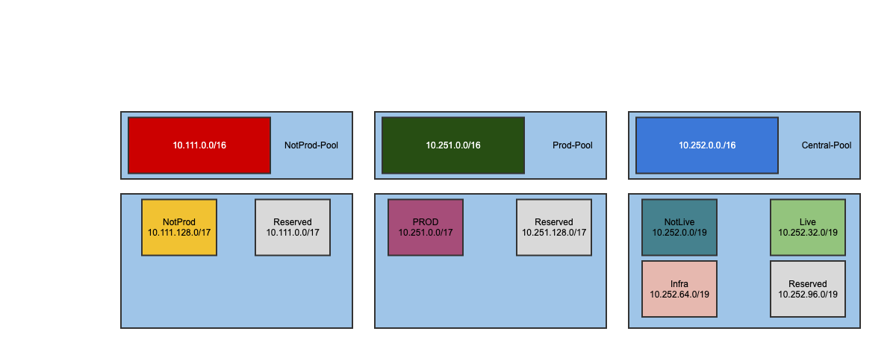

Design Decision Summary
| ID | KDD-09 |  |
| Title | Firewall Egress Allow List Management |  |
| Product | Core Cloud

 |  |
| Category | Bluesolution

 |  |
| Type | Bluedesign decision

 |  |
| Status | RedBLOCKED 

 |  |
| Impact | RedHIGH

 |  |
| Architect |  /  

 |  |
| Jira ref | Home Office Jiraissuekey,summary,issuetype,created,updated,duedate,assignee,reporter,priority,status,resolutionkey,summary,type,created,updated,due,assignee,reporter,priority,status,resolution8cc95e75-9c11-3b7e-8cde-fbdeafd296c6CCL-1317

 |  |

## Background

We currently have a [network architecture](https://collaboration.homeoffice.gov.uk/display/CORE/Proposed+updates+to+network+architecture) where NotProd Workloads, Prod Workloads, NotLive Platform Products and Live Platform Products each have their own centralised egress where connectivity out to the internet for resources within that networking pool is via. This is via an AWS Network Firewall and Internet Gateway.

Within each of these implementations of centralised egress, there is a perimeter firewall which currently is configured with a [set of managed AWS rules to protect against common botnet attacks, exploits](https://collaboration.homeoffice.gov.uk/display/CORE/Central+Egress+Firewall+Policy) etc. We also maintain a whitelist of allowed domains (a list maintained in GitHub and applied/updated using terraform). 

This configuration is applied per egress, allowing us to specify different rules/allowed domains per environment.

As part of recent work to build GitHub and the EKS clusters, we have had to open up a lot of domains on the whitelist to allow access out via the internet.

The list we have already opens us to pulling down un-vetted software and data exfiltration (e.g. [github.com](http://github.com)) - so it's questionable as to how much protection is actually being provided via this whitelist as well as it becoming operationally difficult to scale as the platform grows and more tenants onboard.

Core Cloud is also in the process of integrating with NCSC PDNS for outbound connections to the internet.  It acts as a recursive DNS resolver, filtering and preventing access to known malicious domains. PDNS prevents access to domains known to be malicious, by simply not resolving them. Preventing access to malware, ransomware, phishing attacks, viruses, malicious sites and spyware at source makes the network more secure. 

As part of the PDNS solution, they  curate a set of rules for how the DNS response should be modified if the user queries a malicious domain. This is codified in a database called a Response Policy Zone (RPZ) which the DNS resolver operates on. The rules are created based on knowledge of malicious domains they obtain from commercial, internal and open sources. NCSC review the rules to ensure they do not accidentally block sites that are used for legitimate purposes. When a domain is blocked, users will see a block page that states: *You tried to visit: [http:address of site]. This site may be involved in malicious activity or associated with malware and so access has been blocked.*

Currently Core Cloud doesn't have a centralised artifact storage offering and as such tenants are unable to call upon a centralized location for build time dependencies. This increases the number of sites that need to be accessed.

## Considerations- Security Implication
- Why would we deny by default / allow by default / hybrid approach? Once we route dns lookup through PDNS via NCSC it should block bad domains [Protective Domain Name Service (PDNS) - NCSC.GOV.UK](https://www.ncsc.gov.uk/information/pdns), does this mitigate any of the risk from allow by default?
- Operational ImpactImpact to a customer's application development 
- Impact to Andromeda / Core Cloud Support
- Self Service How can customers add their own firewall rules? 
- What rules should we have around customers doing this? 
- What does AWS best practice recommend
- Group rules by tenants? 
- Tooling - could we use different firewall technology e.g. Fortinet, what are the advantages of this? 
- POISE Internet Gateway - risk of introducing this integration which we don't control?
## AWS Best Practice - Start in [logging-only mode](https://docs.aws.amazon.com/Route53/latest/DeveloperGuide/resolver-dns-firewall-rule-actions.html). Change to block mode after you have validated that legitimate traffic isn’t affected.

- Block DNS traffic going to the internet by using [AWS Firewall Manager policies for network access control lists](https://docs.aws.amazon.com/waf/latest/developerguide/getting-started-fms-network-acl.html) or by using AWS Network Firewall. All DNS queries should route through a Route 53 Resolver, where you can monitor them with Amazon GuardDuty (if enabled) and filter them with [Route 53 Resolver DNS Firewall](https://docs.aws.amazon.com/Route53/latest/DeveloperGuide/resolver-dns-firewall.html) (if enabled). For more information, see [Resolving DNS queries between VPCs and your network](https://docs.aws.amazon.com/Route53/latest/DeveloperGuide/resolver-overview-DSN-queries-to-vpc.html) (Route 53 documentation).

- Use the [AWS Managed Domain Lists](https://docs.aws.amazon.com/Route53/latest/DeveloperGuide/resolver-dns-firewall-managed-domain-lists.html) (Route 53 documentation) in DNS Firewall and Network Firewall.

- Consider blocking high-risk, unused top-level domains, such as .info, .top, .xyz, or some country code domains.

- Consider blocking high-risk, unused ports, such as ports 1389, 4444, 3333, 445, 135, 139, or 53.

- As a starting point, you can use a deny list that includes the AWS managed rules. You can then work over time toward implementing an allow-list model. For example, instead of including only a strict list of fully qualified domain names in the allow list, begin by using some wildcards, such as **.[example.com](http://example.com)*. You can even allow only the top-level domains you expect and block all others. Then, over time, narrow those down too.

- Use [Route 53 Profiles](https://docs.aws.amazon.com/Route53/latest/DeveloperGuide/profiles.html) (Route 53 documentation) to apply DNS-related Route 53 configurations across many VPCs and in different AWS accounts.

- Define a process for handling exceptions to these best practices.

## Use Cases

<!-- TABLE 2: 35 rows -->
| Id | Use Case | Expected Behaviour | Actual Behaviour | Example | Network Path | Platform Security Controls | Account Level Security Controls | Approval |
| --- | --- | --- | --- | --- | --- | --- | --- | --- |
| 1 | A platform product in Central (NotLive) integration testing with another platform product in Central | Allow (default allow) |  | SonarQube Test testing against GitHub Runner Test | Central LZA TGW | Central Firewall Policy | Security Groups |  |
| 2 | A platform product in Central (NotLive) integration testing with another platform product in Central | Deny by default, explicit allow required | Denied by default, but explicit allow succeeded. | PreLive stuff testing against already Live stuff. e.g. Dynatrace PreLive testing against GHES Live i | Central LZA TGW | Central Firewall Policy | Security Groups |  |
| 3 | A NotProd workload connecting to a platform product in Central (Live). | Allow (default allow all NotProd and Prod to access Live) |  | Access from a workload account to GHES / SonarQube e.g. via workspaces/appstream | NotProd LZA TGW → Inspection → NotProd Hub TGW → Central Hub TGW → Central LZA TGW → Inspection | NotProd Firewall PolicyCentral Firewall Policy | Security Groups |  |
| 4 | A Prod workload connecting to a platform product in Central (Live). | Allow (default allow all NotProd and Prod to access Live) |  | Access from a workload account to GHES / SonarQube e.g. via workspaces/appstream | Prod LZA TGW → Inspection → Prod Hub TGW → Central Hub TGW → Central LZA TGW → Inspection | Prod Firewall PolicyCentral Firewall Policy | Security Groups |  |
| 5 | A NotProd workload accessing a shared endpoint in Central (Infra). | Allow (default allow all NotProd and Prod to access Infra) |  | A workload accessing shared endpoint to SNS/SQS etc. | NotProd LZA TGW → Inspection → NotProd Hub TGW → Central Hub TGW → Central LZA TGW | NotProd Inspection Policy.Central Inspection Policy.VPC Endpoint Policy.RCP for supported resource.R | Security Groups |  |
| 6 | A Prod workload accessing a shared endpoint in Central (Infra). | Allow (default allow all NotProd and Prod to access Infra) |  | A workload accessing shared endpoint to SNS/SQS etc. | Prod LZA TGW → Inspection → Prod Hub TGW → Central Hub TGW → Central LZA TGW | Prod Inspection Policy.Central Inspection. Policy VPC Endpoint Policy.RCP for supported resource.Res |  |  |
| 7 | A NotProd Workload accessing a workload in Prod. | Deny |  | A tenant hosted tooling which requires integration across each of their environments. | Prod TGW → Central TGW (No Route) | No network path. |  |  |
| 8 | A NotProd Workload accessing a different workload in NotProd. | Deny by default, explicit allow required |  | Could be Prod trying to access Pre-Prod because they share the same pool. So need to move to default | NotProd LZA TGW | NotProd Inspection Policy.RCP for supported resource.Resource Policy.IAM. | Security Groups |  |
| 9 | A Prod Workload accessing a different workload in Prod. | Deny by default, explicit allow required |  | Could be Prod trying to access Pre-Prod because they share the same pool. So need to move to default | Prod LZA TGW | Prod Inspection Policy.RCP for supported resource.Resource Policy.IAM. | Security Groups |  |
| 10 | A Prod Workload accessing a workload in NotProd. | Deny |  | A tenant testing some shared tooling that requires integration across each multiple environments. | Prod TGW → Central TGW (No Route) | No network path. |  |  |
| 11 | A platform product in Central (NotLive) attempting to access an external service via the CTN. | Allow |  | Where Core Cloud platform products need to send data to or interact with other HO platforms. | Central LZA TGW → Inspection → Central HUB TGW | Central Inspection Policy |  |  |
| 12 | A platform product in Central (Live) attempting to access an external service via the CTN. | Allow |  | Where Core Cloud platform products need to send data to or interact with other HO platforms. | Central LZA TGW → Inspection → Central HUB TGW | Central Inspection Policy |  |  |
| 13 | A NotProd workload attempting to access an external service via CTN. | Allow? |  | As a new tenant it would be nice to just have an account and a VPC that allows connectivity to where | NotProd LZA TGW → Inspection → NotProd HUB TGW | Summary Rules |  |  |
| 14 | A Prod workload attempting to access an external service via CTN. | Allow? |  | As a new tenant it would be nice to just have an account and a VPC that allows connectivity to where | Prod LZA TGW → Inspection → Prod HUB TGW | Summary Rules |  |  |
| 15 | A BYOD device attempting to connect to a platform product in Central (Live). (e.g. GHES via ClientVP | Allow |  | Infra should be able to talk with Live and probably NotLive |  |  |  |  |
| 16 | A platform product in Central (Live) that needs to connect to workloads in both NotProd and Prod. | Allow |  | Shared CI GH Actions Runners |  | Central Inspection PolicyProd Inspection PolicyNotProd Inspection Policy |  |  |
| 17 | A platform product in Central (Live) needing to connect to an external service over the Internet via | Allow (FW domain whitelist) |  | Pulling packages from NPM/Maven etc. Entra auth flow. | Central LZA TGW → Perimeter Central | Central Live Egress Policy |  |  |
| 18 | A platform product in Central (NotLive) needing to connect to an external service over the Internet  | Allow |  | Pulling packages from NPM/Maven etc. Entra auth flow. | Central LZA TGW → Perimeter Central | Central NotLive Egress Policy |  |  |
| 19 | A request coming in from the Internet via central Ingress to a platform product in Central (NotLive) | Deny |  | Not Live products should not be accessible over the Internet. | Perimeter Central → Central LZA TGW → Inspection (No route) | Central NotLive Inspection policy |  |  |
| 20 | A request coming in from the Internet via central Ingress to a platform product in Central (Live). | Allow (Explicit rule) |  | EKS public endpoints have been agreed.Artifactory/SonarQube might require public endpoints. | Perimeter Central → Central LZA TGW → Inspection | Central Live Inspection Policy |  |  |
| 21 | A Prod workload needing to connect to an external service over the Internet via Central Egress. | Allow (subject to NFW rules) |  | Patching and pull down from repositories via YUM updated/ troubleshooting etc. | Prod LZA TGW → Perimeter Prod | Prod Egress policy |  |  |
| 22 | DNS Lookup to and from POISE | Allow |  |  | Network &lt;-&gt; TGW Central &lt;-&gt; TGW HUB |  |  |  |
| 23 | DNS Lookup to and from other platforms e.g. ACP | Allow |  |  | Network &lt;-&gt; TGW Central &lt;-&gt; TGW HUB |  |  |  |
| 24 | DNS lookup forwarding to NCSC | Allow |  |  | Network → NAT G |  |  |  |
| 25 | DNS Lookup Internal Private Hosted Zones | Allow (Restrict to Tenant Zones) |  |  | Route53 Profile Share |  |  |  |
| 26 | A NotProd workload needing to connect to an external service over the Internet via Central Egress. | Allow (subject to NFW rules) |  | Testing new libraries from NPM etc. | NotProd LZA TGW → Perimeter NotProd | NotProd Egress Policy |  |  |
| 27 | A request coming in from the Internet via Ingress to a workload in NotProd | Deny (explicit allow if testing required) |  | Testing integration with service. | Perimeter → NotProd LZA TGW → Inspection | NotProd Inspection Policy |  |  |
| 28 | A request coming in from the Internet via Ingress to a workload in Prod | Deny (explicit allow if required) |  | Enquiry website? Might be able to use static sites instead. | Perimeter → Prod LZA TGW → Inspection | Prod Inspection Policy |  |  |
| 29 | CSOC Integration with Splunk. Sending logs via Kinesis Data Firehose | Allow |  |  |  |  |  |  |
| 30 | A user connecting from POISE over the CTN to a platform product in Central (Live). |  |  | DSA WorkSpaces connecting to GHES | Prod HUB TGW → Prod LZA TGW → Inspection | Central Firewall Policy |  |  |
| 31 | A user connecting from POISE/Internet to AppStream as part of the PAM solution and then connecting t | Allow |  | APA connecting to AppStream instance to support their Prod environment | Internet → AppStream Managed VPC → Public Endpoints | Identity Centre groups |  |  |
| 32 | A platform product in Central (Live) attempting to access another platform product in Central (Live) | Allow |  | GitHub actions needing to scan code with SonarQube | VPC → Central TGW → Inspection→ Central TGW → VPC | Central Inspection Firewall rules. | Security Groups |  |
| 33 | A platform engineer attempting to connect to a platform product in Central (NotLive). (e.g. GHES via | Allow |  | Connecting to PreLive GHES | Perimeter Central → Central LZA TGW → Inspection | VPN ConfigurationCentral Inspection Firewall rules. |  |  |
| 34 | A tenant engineer attempting to connect to a workload in NotProd via ClientVPN | Allow |  | APC / CTF connecting to their tooling | Perimeter NotProd → NotProd LZA TGW → Inspection | VPN ConfigurationNotProd Inspection Policy |  |  |

<!-- TABLE 3: 25 rows -->
| Id | Use Case | Expected Behaviour | Example | Network Path | Platform Security Controls | Account Level Security Controls | Approval |
| --- | --- | --- | --- | --- | --- | --- | --- |
| 1 | A platform product in NotProd (TEST) integration testing with another platform product in NotProd (T | Allow (default allow) | CCPreLiveOpsHub to/from CCPreLiveOpsTooling | NotProd TGW | NotProd Inspection Policy |  |  |
| 2 | A platform product in NotProd (TEST) integration testing with another platform product in Prod (PROD | Deny | CCPreLiveOpsHub to/from ECRLive | No Network path |  |  |  |
| 3 | A NotProd (DEV) workload connecting to a platform product in Prod (PROD). | Deny | APCToolingNotProd to/from DynatraceProd | No Network path |  |  |  |
| 4 | A Prod (PROD) workload connecting to a platform product in Prod (PROD). | Allow (default allow) | AdvancedPassengerArrivalsProd to/from DynatraceProd | ProdTGW | Prod Inspection Policy |  |  |
| 5 | A Prod (PROD) workload connecting to another Prod (PROD) workload. | Allow (default allow) | AdvancedPassengerArrivalsProd to/from CerberusRulesProd | ProdTGW | Prod Inspection Policy |  |  |
| 6 | A NotProd (DEV) workload connecting to a workload in NotProd (TEST) | Deny | CerberusRulesDev to/from AdvancePassengerArrivalsNotProd | NotProd TGW | NotProd Inspection Policy |  |  |
| 7 | A NotProd (DEV) workload accessing a shared endpoint in Infra | Allow (default allow all NotProd and Prod to access Shared) | APCToolingNotProd to/from Network (Endpoint VPC) | NotProdTGW | NotProd Inspection Policy |  |  |
| 8 | A Prod (PROD) workload accessing a shared endpoint in Infra. | Allow (default allow all NotProd and Prod to access Shared) | AdvancedPassengerArrivalsPreProd to/from Network (Endpoint VPC) | ProdTGW | Prod Inspection Policy |  |  |
| 9 | A NotProd (DEV) workload attempting to access an external service via CTN. | Allow/Deny based on summary rule | APCToolingNotProd connecting to ACP via CTN | NotProdTGW | Summary Rules |  |  |
| 10 | A Prod (PREPROD) workload attempting to access an external service via CTN. | Allow/Deny based on summary rule | AdvancedPassengerArrivalsPreProd connecting to ACP CDLZ via CTN | ProdTGW | Summary Rules |  |  |
| 11 | A BYOD VPN device attempting to connect to a platform product in Prod (PROD). (e.g. GHES via ClientV | Allow, destination limited to GHES | APA DevOps engineer connecting to GHES via Client VPNPerimeterProd to CILive |  | VPN Only Routes to GHES Prod Inspection Policy |  |  |
| 12 | A platform product in Prod (PROD) that needs to connect to workloads in both NotProd (DEV, TEST) and | Allow (default allow)Allow (Explicit rule) | GitHub Action Runners connecting to AdvancedPassengerArrivalsPreProd GitHub Action Runners connectin | ProdTGWNotProd | Prod Inspection PolicyNotProd Inspection Policy |  |  |
| 13 | A Prod (PROD) platform product needing to connect to an external service over the Internet via Centr | Allow (FW domain whitelist) | CILive → Internet | ProdTGW → Prod Central Egress | Prod Central Egress Policy |  |  |
| 14 | A NotProd (TEST) platform product needing to connect to an external service over the Internet via Ce | Allow (Allow All external domains) | CCPreLiveOpsHub → Internet | NotProd TGW → NotProd Central Egress | NotProd Central Egress Policy |  |  |
| 15 | A request coming in from the Internet via central Ingress to a platform product in Prod (PROD). | Allow (Explicit rule) | Connection to EKS public endpoint. | Prod Central Ingress → ProdTGW | Ingress ConfiguredProd Inspection Policy |  |  |
| 16 | A Prod (PROD) workload needing to connect to an external service over the Internet via Central Egres | Allow (FW domain whitelist) | AdvancedPassengerArrivalsProd → Internet |  |  |  |  |
| 17 | DNS Lookup to and from POISE | Allow |  |  |  |  |  |
| 18 | DNS Lookup to and from other platforms e.g. ACP | Allow |  |  |  |  |  |
| 19 | DNS lookup forwarding to NCSC | Allow |  |  |  |  |  |
| 20 | DNS Lookup Internal Private Hosted Zones | Allow (Restrict to Tenant Zones) |  |  |  |  |  |
| 21 | A NotProd (DEV) workload needing to connect to an external service over the Internet via Central Egr | Allow (Allow All external domains) | APCToolingNotProd to Internet |  | PerimeterNotProd Egress Policy |  |  |
| 22 | CSOC Integration with Splunk | Allow | Sending logs via Kinesis Data Firehose |  |  |  |  |
| 23 | A user connecting from POISE over the CTN to a platform product in Central (PROD). |  | DSA WorkSpaces connecting to GHES | ProdTGW | Prod Inspection Policy |  |  |
| 24 | A user connecting from POISE/Internet to AppStream as part of the PAM solution and then connecting t | Allow | APA connecting to AppStream instance to support their Prod environment | Internet → AppStream Managed VPC → Public Endpoints | Identity Centre groups |  |  |

## Options
- Diagrams, such as architectural views or sequence diagrams, may be used to help illustrate the options but are not mandated.

Option 1 - Allow by default on all egress firewallsThis option allows all outbound traffic by default on all egress firewalls. Traffic would still go via the NCSC PDNS solution so known malicious domains would be blocked still. We could look to also use AWS Managed Domain Lists on the Route 53 Resolver DNS Firewall to add additional security for high risk domains.

Operationally and from a DevEx perspective this would be the best solution as tenants and platform engineers would have access to egress with protection from known bad domains without needing changes/approvals.

From a security perspective it's not good practice to allow unnecessary connections outbound, especially given the types of data that could be stored in tenant accounts.

#### Pros- x
#### Cons- x
Option 2 - Deny by default on all egress firewallsThis approach denies all outbound traffic by default on egress firewalls. Domains then need to be added to an allow list to enable outbound connections to them. This can be done per egress so it's possible to only allow connectivity where required e.g. allow in Tenant Not Prod but keep it blocked in NotProd. Outbound requests that are on the allow list would still be routed via the NCSC PDNS solution, offering security in the event the domain is no longer trusted,

This option is the one currently in place on Core Cloud and we are seeing multiple issues with it already, even with a limited number of tenants and platform products using the platform.

One of these issues is the overhead of managing allow list across just 2 egress firewalls, let alone 4. From an engineering perspective this takes time and effort and there also needs to be a process in place for approving these outbound connections that has overhead on the responsible party.

Another issue that causes tenants major impact is that we have seen the location of dependencies change e.g. java moved from storing in GitHub to S3 between versions. This meant that when they next pulled down the library it was in a different location that wasn't on the allow list and their pipelines failed causing them significant issue. 

For these reasons this approach, whilst somewhat secure, causes large overheads as well as a poor DevEx. The secure aspect can become reduced as people open up wide ranging address e.g. [github.com](http://github.com) to allow for ease of work, despite impacting our security position.

c1f6b57d-1e9c-42b3-8c3a-8cf44695b034Option 2Option 25

#### Pros- x
#### Cons- x
Option 3 - Tenant NotProd and Platform NotLive allow by default, Tenant Prod and Platform Live deny by defaultThis option would allow both Tenant NotProd workloads and Platform NotLive products out via the egress without having to add domains to the allow list. They would still be routed via PDNS and potentially AWS Managed Domain List to provide a level of protection but allow speed of development in environments which are not holding production data.

Tenant Prod Workloads and Platform Live products could then have a default deny applied where domains need to be added to the allow list to allow connections. This would mean that tenant accounts would only have access to domains as required for their application integrations.

From a CI perspective any external libraires would need adding to the allow list, however this would still result in the issues seen within Option 2 if domains change as part of CICD pipelines and build time dependencies. 

#### Pros- x
#### Cons- x
Option 4 - Tenant NotProd, Tenant Prod and Platform NotLive deny by default, and Platform Live allow by defaultOption 4 configures the egress firewalls so that all Tenant workload accounts and platform NotLive accounts are denied by default and need to be added to the allow list when there is a use case that requires egress to an external domain. The Platform Live egress is allow by default via PDNS and possibly AWS Managed Domain Lists to provide a level of protection from malicious domains.

This option limits the risk of data exfiltration from tenant accounts but allow speed of development using the Core Cloud CICD offerings where access to external domains is allowed by default. This would also mitigate against the issues we have seen already with the existing deny by default approach.

One caveat is that if tenants run tooling in their accounts they would be routed via the tenant egress firewalls which would be deny by default so may run into some complications there with increasing allow lists to support this. 

#### Pros- x
#### Cons- x
Option 5 - Allow by default but block certain categories of domainsCurrently on Core Cloud we use AWS Network Firewall for managing egress. AWS Marketplace has multiple providers of Next Gen Firewall (NFGW) including Fortinet and Palo Alto. Some of these NGFWs have additional capabilities that the AWS Network Firewall doesn't.

One example is the Palo Alto which allows you the ability to block URLS based on pre-defined risk categories as per this [link](https://docs.paloaltonetworks.com/cloud-ngfw-aws/administration/protect/cloud-ngfw-native-policy-management/security-profiles/predefined-url-categories-for-cloud-ngfw-for-aws).

This could be used in conjunction with an allow by default approach and AWS Managed Domain Lists and PDNS to create a layered approach to protecting malicious domains as well as keeping the system with minimal overheads and a good DevEx.

Alternatively these could be used as part of one of the previous options such as Option 4 and using one of the NGFWs in Platform Live to reduce the risk of that being allow by default.

#### Pros- x
#### Cons- x
Option 6 - Tenant Red/Green and Platform deny by defaultCurrently on Core Cloud we use AWS Network Firewall for managing egress. AWS Marketplace has multiple providers of Next Gen Firewall (NFGW) including Fortinet and Palo Alto. Some of these NGFWs have additional capabilities that the AWS Network Firewall doesn't.

One example is the Palo Alto which allows you the ability to block URLS based on pre-defined risk categories as per this [link](https://docs.paloaltonetworks.com/cloud-ngfw-aws/administration/protect/cloud-ngfw-native-policy-management/security-profiles/predefined-url-categories-for-cloud-ngfw-for-aws).

This could be used in conjunction with an allow by default approach and AWS Managed Domain Lists and PDNS to create a layered approach to protecting malicious domains as well as keeping the system with minimal overheads and a good DevEx.

Alternatively these could be used as part of one of the previous options such as Option 4 and using one of the NGFWs in Platform Live to reduce the risk of that being allow by default.

#### Pros- x
#### Cons- x
Option 6b - Tenant Red/Green and Platform deny by default with restrictions on package sourcesThis is an iteration on Option 6 as it has a dependency on Artifactory being available to platform and tenant projects. The only change from Option 6 is to the Platform Live egress allow list approach.

With Artifactory available as a centralised offering for binaries/build time dependencies, the number of external connections out to collect these packages should be heavily reduced. Once this is in place we can use Artifactory to reduce the size of the allow list on the Platform Live egress where CICD operations run. This reduces the exposure for egress and means we can also benefit from functionality within Artifactory such as Xray to provide an easy and proactive solution for identifying security vulnerabilities in open-source and other third-party software.

#### Pros- x
#### Cons- x
## Discounted Options

| Option Ref and Name | Brief Description | Rationale for discounting |  |
| 
 | 
 | 
 |  |

## Evaluation Alignment with **[Architecture Principles](https://confluence.bics-collaboration.homeoffice.gov.uk/display/AD/1.3+-+Home+Office+Principles)**

true- Alignment with **[Architecture Principles](https://confluence.bics-collaboration.homeoffice.gov.uk/display/AD/1.3+-+Home+Office+Principles)**, Standards and Patterns:Add or remove a column as required to match the number of options
- Rate each option against the relevant architecture principles in the table (leave blank if not applicable) - trueGreenYes trueNeutral trueRedNo
- Summarise your evaluation in a paragraph after the table. At this point, you should also consider non-functional and commercial aspects of the options as well as functional and architectural fit.

| Principle | Option 1 | Option 2 | Option 3 |  |
| E1 - One Home Office

 | 
 | 
 | 
 |  |
| E2 - Maximum benefit at lowest cost and risk

 | 
 | 
 | 
 |  |
| E3 - Continuity of critical Home Office functions

 | 
 | 
 | 
 |  |
| E4 - Compliance with policies and standards

 | 
 | 
 | 
 |  |
| E5 - Just Enough Architecture

 | 
 | 
 | 
 |  |
| E6 - We own the design

 | 
 | 
 | 
 |  |
| E7 - Convergence with the future state architecture

 | 
 | 
 | 
 |  |
| E8 - Commodity cloud first

 | 
 | 
 | 
 |  |
| E9 - Service qualities are as important as user needs

 | 
 | 
 | 
 |  |
| S1 - Adaptability and flexibility

 | 
 | 
 | 
 |  |
| S2 - Cloud native applications

 | 
 | 
 | 
 |  |
| S3 - Think big, deliver small

 | 
 | 
 | 
 |  |
| S4 - Services are loosely coupled

 | 
 | 
 | 
 |  |
| U1 - Services are designed around the needs of the user

 | 
 | 
 | 
 |  |
| U2 - Services are device agnostic

 | 
 | 
 | 
 |  |
| D1 - Information is treated as an asset

 | 
 | 
 | 
 |  |
| D2 - Information is appropriately protected, secured and accessed

 | 
 | 
 | 
 |  |
| D3 - Consistent terminology and definitions

 | 
 | 
 | 
 |  |
| P1 - Common platforms and reusable components

 | 
 | 
 | 
 |  |
| P2 - Control of technical diversity

 | 
 | 
 | 
 |  |
| P3 - Open standards, open data, open source

 | 
 | 
 | 
 |  |
| Sc1 - Secure by Design

 | 
 | 
 | 
 |  |
| Sc2 - Secure services above infrastructure

 | 
 | 
 | 
 |  |

| Option 

 | YES | NEUTRAL | NO |  |
| 1. Option Name

 | 
 | 
 | 
 |  |
| 2. Option Name | 
 | 
 | 
 |  |
| 3. Option Name | 
 | 
 | 
 |  |

## Recommendation and rationale It is highly recommended that Option n (Title) is adopted as it ...

## Reviewers / Approval date 
| Name | Role | Review Date | Approval Date |  |
| 
 | 
 | 
 | 
 |  |
| 
 | 
 | 
 | 
 |  |
| 
 | 
 | 
 | 
 |  |

## Consequences and next steps 

3
d702fb12-a0f2-4b0e-8864-652b251facf4
incomplete
Document reviewed by Core Cloud Teams

4
df25fc55-697c-4271-9b58-71f48ecfdc5b
incomplete
Actions raised via DMR process